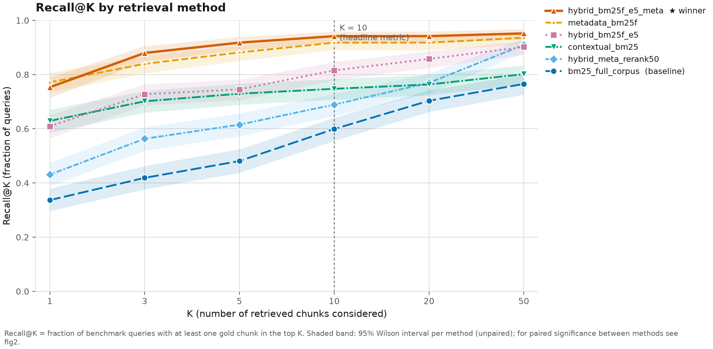
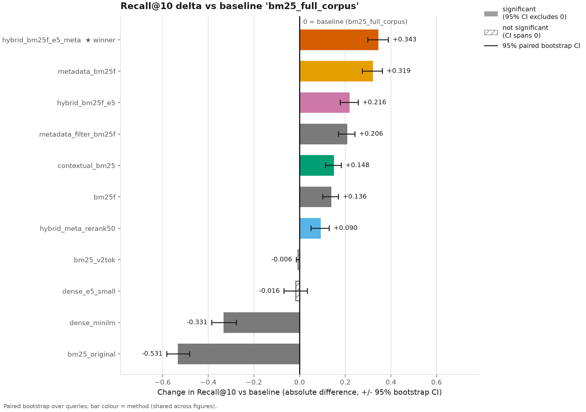
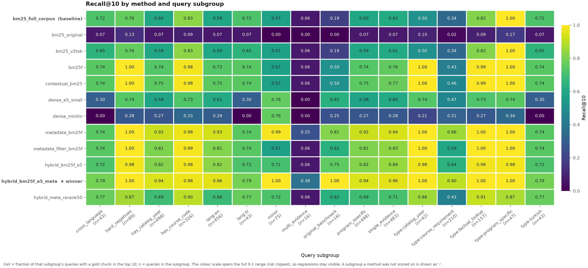
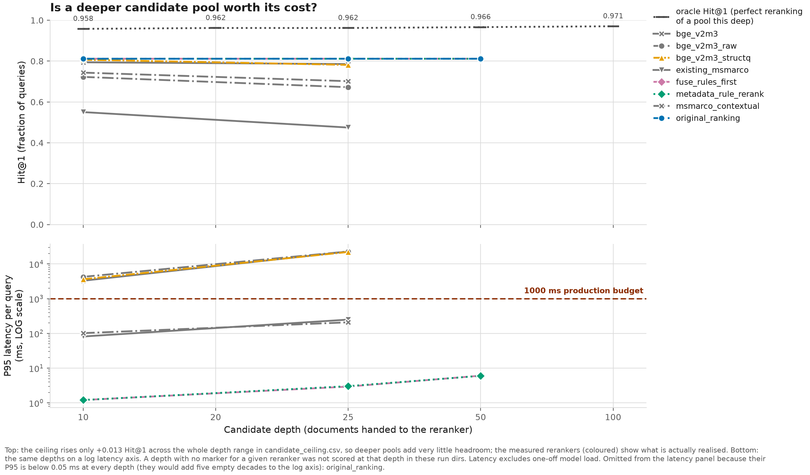
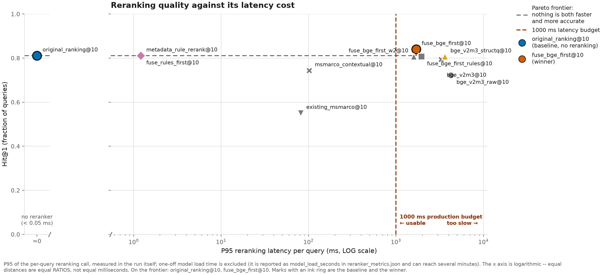
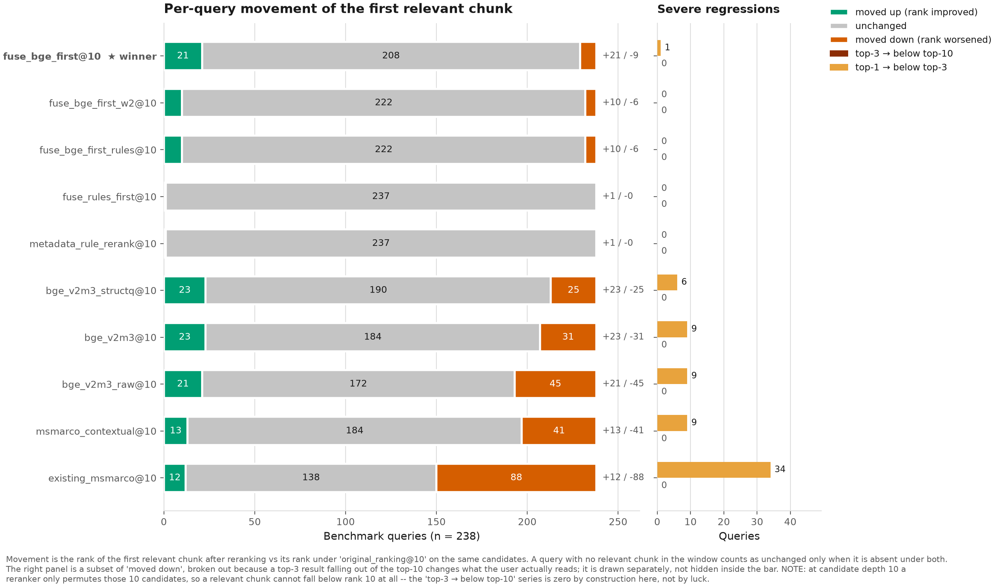

# adviSU — Retrieval-Augmented Academic Advising System

**Sabancı University · CS 455 project**
Team: Mehmet Selman Yılmaz, Korhan Erdoğdu

adviSU is a profile-aware academic advising assistant for Sabancı University. A student sets
their **program + curriculum (admit) term** and **course history**, then asks questions like
*"does CS 455 count as an area elective for me?"* or *"how many credits do I still need?"*.
adviSU answers from the **official degree-requirement data for that exact program and term**,
computes graduation progress **deterministically in code**, and uses an LLM only to explain
the result — never to invent the numbers.

The system deliberately **never mixes requirements across programs or curriculum years**: a CS
2024 student never sees IE requirements, and if the exact official requirement file is missing
it says so instead of guessing.

---

## v2 experience and safety additions

- Responses preserve the historical Markdown `response` field and also expose `summary`,
  `structured_content`, and export links. The UI renders GFM tables and KaTeX formulas and can
  download course history or degree-audit rows as CSV/XLSX.
- Every substantive answer ends with a compact **Kısa Özet / Short Summary**. A deterministic
  fallback supplies it if the provider omits the requested section.
- Writing **"CS 201'i aldım"**, **"CS 300'e kayıtlıyım"**, or **"MATH 101'i sil"** mutates only
  those course-history rows. Other saved courses remain intact, and the same request immediately
  answers from the updated MongoDB profile.
- Session memory passes the last three bounded turns into the prompt for follow-up meaning, while
  official curriculum documents and the deterministic audit remain authoritative.
- Chat history can be collapsed, pinned, renamed, and deleted. After the second turn, an unedited
  title is regenerated from the first conversation topics.
- Light/dark/system theme support is global and persisted. Students get a clean answer surface;
  technical source chips and document upload remain admin-only.
- `/ask/stream` streams NDJSON token events while `/ask/` stays backward compatible.
- Intent routing is benchmark-selected: multilingual BERT is used only because its measured
  macro-F1 exceeded the existing TF-IDF classifier; any load failure falls back to TF-IDF.

---

## What's implemented

### Data corpus (in-repo, `data/`)
Scraped from the public Sabancı degree-detail pages and stored as pre-chunked JSONL (one
requirement chunk per line, with a ready `text` field, stable `chunk_id`, and flat metadata).

| Path | What | Size |
|---|---|---|
| `data/degree_requirements/<PROGRAM>/<TERM>.jsonl` | Official degree requirements — **9 majors × 4 admit terms** | 36 files |
| `data/minors/<CODE>/<TERM>.jsonl` | Minor programs — **17 minors × 4 terms** | 68 files |
| `data/curricula/registry.jsonl` | Which program × term curricula exist (drives the UI selector + missing-data checks) | 104 rows |
| `data/course_catalog/current.jsonl` | Searchable course list — **816 distinct courses** (code, title, SU, ECTS, faculty, **+ per-course engineering/basic-science ECTS**) | 816 rows |

- **Majors:** CS (BSCS), IE (BSMS), BIO (BSBIO), ME (BSME), EE (BSEE), PSY (BAPSY),
  ECON (BAECON), DSA (BSDSA), MAT (BSMAT).
- **Admit terms:** Fall 2022-23 (`202201`), 2023-24 (`202301`), 2024-25 (`202401`), 2025-26 (`202501`).
- Each requirement chunk carries `data_role` (`curriculum_requirement` for majors,
  `minor_requirement` for minors), `program`, `curriculum_term`, `requirement_category`,
  `course_id`, `su_credits`, `ects`, `faculty`, and a `document_type`
  (`..._profile` / `..._category_pool` / `..._pool_course` / `..._rule`).
- **Free/area/core classification is NOT stored on courses** — it depends on the student's
  program + admit term and is answered from the degree-requirement data.
- Offline regeneration pipeline lives in `server/scripts/degree_gen/` (see its README).

### Where the data comes from (exact source links)
Everything is scraped from the public Sabancı prospective-students site. Program codes:
CS=`BSCS`, IE=`BSMS`, BIO=`BSBIO`, ME=`BSME`, EE=`BSEE`, PSY=`BAPSY`, ECON=`BAECON`, DSA=`BSDSA`,
MAT=`BSMAT`. Terms: `202201 202301 202401 202501`.

1. **Major requirements (main page):** `.../degree-detail?SU_DEGREE.p_degree_detail?P_TERM=<TERM>&P_PROGRAM=<CODE>&P_LANG=EN&P_LEVEL=UG` — totals, University + Required lists, category minimums, pool links.
2. **Elective / faculty pools:** `.../degree-detail?SU_DEGREE.p_list_courses?P_TERM=<TERM>&P_AREA=<AREA>&P_PROGRAM=<CODE>&P_LANG=EN&P_LEVEL=UG` where `<AREA>` = `<CODE>_CEL/AEL/FEL` or `FC_FENS|FC_FASS|FC_SOM` (EE uses `_ARE/_FRE`, PSY uses `_COR/ARE/FRE`).
3. **Minor list:** `https://suis.sabanciuniv.edu/prod/SU_DEGREE.p_list_degree?P_LEVEL=UG&P_LANG=EN&P_PRG_TYPE=MINOR`; minor detail = the same `p_degree_detail` with `P_PROGRAM=<CODE>-MINOR`.
4. **Per-course engineering / basic-science ECTS:** each course's catalog page (linked from every pool row) — `.../degree-detail?sabanci_www.p_get_courses?levl_code=UG&subj_code=<SUBJ>&crse_numb=<NUM>&lang=eng`, which shows e.g. `6 ECTS (ENGINEERING:0 / BASIC:6)`. Scraped by `npm run scrape:credits` (816/816 filled).

### Vector store (ChromaDB)
The whole corpus is embedded into a single collection **`su_knowledge`** (~30,343 vectors:
28,082 degree-requirement + 2,261 minor chunks). Ingested by
`server/scripts/ingest_degree_requirements.py` (reads the pre-chunked JSONL directly,
scalarizes metadata, upserts). Chroma is a reproducible index, not the source of truth.

### Source of truth (MongoDB, db `advisu`)
- `users` — includes each student's `academic_profile` (major, degree_code, curriculum_term,
  minor_codes). `curriculum_term` is the admit term — the graduation contract that both retrieval
  scoping and the degree audit key off.
- `courses` — the ~816-course catalog (seeded from `course_catalog/current.jsonl`) that the
  course-history picker searches. Fields include `su_credits`, `ects`, and
  `engineering_ects` / `basic_science_ects` slots (see *Known limitations*).
- `user_courses` — the student's course history **with per-course status**
  (`completed` / `enrolled` / `failed` / `withdrawn` / `transfer` / `exempted`); only
  credit-eligible statuses count toward graduation.
- `conversations` — bounded session memory (last few turns) for follow-up questions.
- Plus the existing ingestion/source-of-truth collections (`sourceDocuments`,
  `ingestionJobs`, `uploadBatches`, `instructorReviews`, `exams`, `embeddingCache`).
- The Mongo client connects **lazily**, so the backend boots even if Mongo is briefly
  unreachable — only DB-backed calls fail until it's up.

### Backend intelligence
- **Profile-aware retrieval** (`server/modules/retrieval_policy.py`): each intent maps to an
  allowed `data_role` + required profile fields, and retrieval is hard-filtered by
  data_role / program / curriculum_term **before** reranking, so results never cross program
  or curriculum boundaries.
- **Missing-data safety**: an authoritative audit is only attempted when the required profile
  fields exist AND the exact official file is in the registry; otherwise adviSU returns a safe
  "authoritative audit unavailable" message.
- **Deterministic degree audit** (`server/modules/degree_audit.py`): SU-credit category
  allocation (university / required / core / area / free) with overflow (extra core → area →
  free), choice-pool handling (e.g. MATH 201 *or* MATH 212), and missing-required detection —
  all computed in code from the exact requirement file + the student's completed courses.
- **Hybrid retrieval** (`server/modules/bm25_retriever.py`): dependency-free BM25 runs over the
  same profile-scoped subset as vector search and is fused into ranking, sharpening exact
  matches like "CS 455" / "202401".
- **Conversation memory** (`server/modules/conversation_memory.py`): resolves follow-ups like
  *"can I take it next semester?"* to the course from the previous turn. Never overrides
  official data.
- **Curriculum registry** (`server/modules/curriculum_registry.py`): read-only access to
  `registry.jsonl`.
- **Selectable retrieval modes** (`server/modules/retrieval_modes.py`): the same question can be
  answered under `llm_only` / `bm25` / `dense` / `hybrid` / `hybrid_rerank`, so the evaluation can
  measure what each component contributes. Every RAG mode receives the *same* profile-scoped
  metadata filter — ablating a retriever changes ranking, never the corpus a student can see.
  The **product** always runs one mode and shows no picker: `DEFAULT_RETRIEVAL_MODE=hybrid`,
  chosen because that is what our own benchmark measured as best (see *Evaluation*).
- **Language consistency** (`llm.detect_language`): the reply language is decided in code from the
  question and injected as a top-priority directive. The system prompt is written in Turkish, which
  used to pull English questions into Turkish answers; a code-decided directive fixes that.
- **Chat history** (`server/modules/conversation_memory.py`): a durable `messages[]` transcript with
  a title per session, stored *alongside* the capped 5-turn `recent_turns` used for prompt working
  memory. The two are separate on purpose — one is browsable history, the other must stay bounded.
- Existing document RAG (uploads, exams, WhatsApp instructor reviews) is preserved.

### Frontend (React + Vite + TS + Tailwind)

Two deliberate visual registers: **dark chrome** for login and chat, **light Sabancı palette**
(`#F5F8FC` page, `#004B93` header, white cards) for the two setup pages, so they read as one section.

| Route | Screen |
|---|---|
| `/login` | Split layout — darkened campus photo, reversed logo, a word-by-word typewriter tagline, and example questions set as quotations. Sign-in panel on the right. |
| `/` | Chat. Sidebar is thread-based (New chat, titled history, delete). Empty state is spare: *"Are we graduating?"*. Gold banner prompts for a profile when one isn't set. |
| `/courses` | **Course History** — saved completed courses with a running SU total (so you can see what the system thinks you finished), plus the course picker and document upload. |
| `/profile` | **Profile & Degree Audit** — pick major + curriculum term from the live registry, save, and run the deterministic audit (per-category table, Eng/Basic ECTS, missing required). |

**Logo assets.** `adviSU-logo.png` is `big.png` trimmed of transparent padding;
`adviSU-logo-reversed.png` is a **knockout variant for dark backgrounds** — the lockup's descriptor
type and "SU" glyphs are navy and disappear on dark, so blue-dominant dark pixels are remapped to
white while the gold/teal accents are kept. Use the reversed variant on dark surfaces rather than
placing the logo on a white plate.

**No retrieval-mode picker.** Choosing a retrieval strategy isn't a student's job; the server runs
the measured-best configuration.

---

## Requirements pipeline (how a question is answered)

```text
question (+ username, session_id)
  -> resolve "this course" via session memory
  -> intent detection (TF-IDF/LogReg) + regex route guards  (+ new "minor" intent)
  -> load student academic_profile from MongoDB
  -> retrieval policy: allowed data_role + required profile fields
  -> missing-profile / missing-file gate  ->  safe limitation if not satisfiable
  -> profile-scoped retrieval (data_role + program + curriculum_term)  [vector + BM25 hybrid]
  -> CrossEncoder rerank
  -> for graduation questions: run deterministic degree_audit and inject it as an
     authoritative context source
  -> LLM (Groq Llama) explains the grounded evidence + audit  ->  answer + sources + intent
```

**What the LLM actually receives.** The prompt context is assembled from: (a) the retrieved
degree-requirement chunks from ChromaDB, (b) a `[Source: MongoDB student profile]` block — the
student's completed-course list and credit totals in natural language, and (c) a
`[Source: Deterministic degree audit]` block — the audit JSON computed in code from the MongoDB
course history. So the student's **derived academic data from MongoDB is passed to the LLM as
context**, and the model is instructed to *explain* those authoritative numbers, not recompute or
contradict them. The raw MongoDB connection string / credentials are never sent — only the derived
per-student facts.

---

## Setup

### Recommended: Docker Desktop (Windows and macOS)

Install Docker Desktop, copy `.env.example` to `.env`, add the provider key, then run from the
repository root:

```bash
docker compose up --build
```

Open **http://localhost:5173**. Student demo: `student / student`; admin demo:
`admin / admin`. API docs are at **http://localhost:8000/docs**.

The first start builds the Chroma index from the bundled official JSONL corpus and downloads the
embedding model, so it is slower than later starts. MongoDB, Chroma, uploads, and the Hugging Face
cache use named volumes to avoid Windows/macOS bind-mount permission differences. Stop with
`docker compose down`; add `-v` only when you explicitly want to erase local application data.

### 1. Backend
```powershell
cd server
python -m venv myenv
.\myenv\Scripts\Activate.ps1
pip install -r requirements.txt
python -m uvicorn main:app --reload   # http://127.0.0.1:8000  (health: /test)
```

### 2. Environment (`.env` in the project root)
The backend reads a single `.env` (there is no committed `.env.example`; `.env` is gitignored).

```env
# Required for chat answers:
GROQ_API_KEY=your_groq_api_key
# Required for profile / course history / audit:
MONGO_URI=mongodb+srv://<user>:<pass>@<cluster>.mongodb.net/?retryWrites=true&w=majority
MONGO_DB_NAME=advisu

# Sensible defaults (override only if needed):
GROQ_MODEL_NAME=llama-3.3-70b-versatile
CHROMA_PERSIST_DIR=./chroma_store
CHROMA_COLLECTION_NAME=su_knowledge
EMBEDDING_MODEL_NAME=sentence-transformers/all-MiniLM-L12-v2
CROSS_ENCODER_MODEL_NAME=cross-encoder/ms-marco-MiniLM-L-6-v2
RETRIEVAL_CANDIDATE_K=20
RERANK_TOP_K=6
# DEGREE_DATA_DIR  -> leave unset; defaults to <project>/data (absolute)
```
> For MongoDB Atlas: create a DB user and add your IP (or `0.0.0.0/0` for dev) under Network Access.

### 3. Build data + index (one-time, or after regenerating the corpus)
```bash
npm run registry          # build data/curricula/registry.jsonl
npm run catalog           # build data/course_catalog/current.jsonl (816 courses)
npm run ingest:degrees:reset   # embed the corpus into ChromaDB (~30k vectors)
npm run seed:courses      # push the course catalog into MongoDB (search bar)
npm run validate:data     # (optional) validate corpus + coverage report
npm run test:advising     # (optional) run the invariant test suite
```

### 4. Frontend
```powershell
cd frontend
npm install
npm run dev               # http://localhost:5173
```
Override the API base with `frontend/.env` → `VITE_API_URL=http://127.0.0.1:8000`.

### Using it
Log in (`student` / `student`) → **Profile & degree audit** in the sidebar → pick your major +
curriculum term → **Save** → add completed courses in the course picker → **Run audit**, or
just ask questions in the chat.

---

## API endpoints (advising)

| Method | Endpoint | Description |
|---|---|---|
| `POST` | `/ask/` | Ask a question (form: `question`; optional `username`, `session_id`, `mode`, `top_k`, `prompt_strategy`, `expert_mode`). Posting only `question` uses `DEFAULT_RETRIEVAL_MODE` (`hybrid`). The UI never sends `mode`; the evaluation harness does. |
| `POST` | `/ask/stream` | Same answer contract over NDJSON metadata/token/done events |
| `GET`  | `/users/{username}/conversations` | Chat history for the sidebar (newest first, titles only) |
| `GET` / `PATCH` / `DELETE` | `/conversations/{session_id}` | Full transcript / rename or pin / delete |
| `GET`  | `/curricula/` | All valid curricula (programs, majors, minors) for the UI selector |
| `GET`  | `/curricula/{program}` | Curriculum terms available for a program |
| `GET` / `PUT` | `/users/{username}/profile` | Read / set the student academic profile |
| `GET` / `PUT` | `/users/{username}/courses` | Read / set course history (PUT accepts per-course `statuses`) |
| `GET` | `/users/{username}/courses/export?format=csv\|xlsx` | Download course history |
| `GET`  | `/users/{username}/degree-audit` | Deterministic degree audit for the saved profile |
| `GET` | `/users/{username}/degree-audit/export?format=csv\|xlsx` | Download audit table |
| `GET`  | `/courses/` | Search the course catalog (`search`, `limit`) |
| `POST` | `/auth/login` | Admin login |
| `GET`  | `/test` | Health check |

Legacy document-RAG endpoints are preserved: `POST /upload_documents/`, `POST /upload_pdfs/`,
`POST /admin/whatsapp/upload`, `POST /admin/whatsapp/{batch_id}/confirm`,
`POST /admin/exams/upload`, `DELETE /sources/{source_id}`.

---

## npm scripts

| Script | Purpose |
|---|---|
| `npm run registry` | Rebuild `data/curricula/registry.jsonl` |
| `npm run catalog` | Rebuild `data/course_catalog/current.jsonl` |
| `npm run ingest:degrees[:reset]` | Embed the degree/minor corpus into ChromaDB |
| `npm run seed:courses` | Force-seed the course catalog into MongoDB |
| `npm run validate:data` | Validate corpus + print a coverage report |
| `npm run test:advising` | Run the invariant test suite (18 unit + integration) |
| `npm run ingest:all\|courses\|reviews\|exams` | Legacy document/source ingestion |
| `npm run benchmark:build` | Regenerate `data/benchmark/questions.jsonl` from the corpus |
| `npm run eval` | Run the benchmark across all retrieval modes (generates answers) |
| `npm run eval:retrieval` | Same, retrieval metrics only — no LLM calls, no API cost |
| `npm run eval:ablate` | Run the ablation grid from `ablation_configs.yaml` |
| `npm run eval:tables` | Write report-ready CSVs to `outputs/tables/` |

---

## Evaluation

The retrieval and hallucination evaluation lives under `server/evaluation/`.

```bash
npm run benchmark:build   # derive the benchmark from data/ (never hand-written answers)
npm run eval:retrieval    # Recall@k / MRR@k / nDCG@k per mode
npm run eval              # + generated answers (needs Groq quota)
npm run eval:ablate       # mode x top_k grid
npm run eval:tables       # outputs/tables/*.csv + outputs/failure_analysis/failure_cases.csv
```

**Ground truth is derived, not written.** `build_benchmark.py` reads real rows out of
`data/degree_requirements/**`, so each question's gold `chunk_id` and reference answer come from
the corpus itself and cannot drift from it. The builder aborts if any gold id is missing.

Measured results, the full method, and the caveats are in **[`docs/experiment_log.md`](docs/experiment_log.md)**.
Two findings worth flagging here:

- **Retrieval materially reduces hallucination.** With BM25 retrieval the system reproduced the
  correct official number in 93% of answers and declined 67% of unsupported questions; the same
  model with no retrieval (`llm_only`) scored 27% and **refused nothing at all**.
- **The CrossEncoder reranker hurts recall on this corpus** (Recall@6 0.44 vs 0.62 for plain
  hybrid) and adds ~295 ms per query. Reproduced at every top-k. **This measurement changed the
  product:** the default is now `hybrid`, not `hybrid_rerank`. Set
  `DEFAULT_RETRIEVAL_MODE=hybrid_rerank` to revert. Caveat: the benchmark is 16 answerable
  questions with templated wording — a real but small sample.

### v2 model-selection measurements (2026-07-24)

- **Intent:** 84 bilingual examples, four-fold stratified cross-validation, same folds.
  TF-IDF/LogReg macro-F1 **0.3482** vs multilingual MiniLM/BERT embeddings + LogReg
  **0.7373**. BERT therefore ships; the measured decision is committed in
  `data/benchmark/intent_model_selection.json`.
- **Prompt strategy:** one batched provider call per candidate over six exact graph/academic
  lookup tasks. `basic`, `lookup`, `algorithmic`, and `structured_lookup` each scored **6/6**.
  `structured_lookup` wins the documented tie-break because it also matches the structured-table
  product contract. See `data/benchmark/prompt_strategy_selection.json`.
- **Reranking:** the existing corpus-derived benchmark still rejects CrossEncoder as the product
  default: hybrid Recall@6 **0.625** vs hybrid+rerank **0.438**, with added latency. The reranked
  mode remains available for reproducibility and rollback, but the measured winner stays
  `hybrid`.

Answer-quality columns (`answer_correctness`, `faithfulness`, `citation_correctness`,
`hallucination_rate`) are intentionally **left empty** for manual labelling — do not quote answer
quality beyond the objective reference-number signal until they are filled in.

---

## Retrieval benchmark (2026-07-28) — BM25 replaced

Full method, statistics and caveats: **[`docs/retrieval_benchmark_report.md`](docs/retrieval_benchmark_report.md)**.
Reproduction commands: **[`docs/retrieval_lab.md`](docs/retrieval_lab.md)**.
Acceptance rule frozen *before* the test split was scored:
**[`docs/retrieval_winner_selection_preregistration.md`](docs/retrieval_winner_selection_preregistration.md)**.

### Result

`hybrid_meta` (field-weighted BM25F + multilingual-E5-small fused by RRF + soft metadata and
record-type boosts) is now the production default, replacing `hybrid`.

| Method | Recall@10 | Hit@1 | MRR@10 | nDCG@10 | P95 |
|---|---:|---:|---:|---:|---:|
| `bm25_original` (as shipped, incl. 3000-doc cap) | 0.0681 | 0.0501 | 0.0567 | 0.0595 | 6 ms |
| `bm25_full_corpus` (fair baseline) | 0.5992 | 0.3367 | 0.4029 | 0.4481 | 65 ms |
| `metadata_bm25f` (lexical only) | 0.9178 | **0.7715** | 0.8169 | 0.8398 | 265 ms |
| **`hybrid_meta` (default)** | **0.9419** | 0.7535 | 0.8228 | 0.8491 | 398 ms |

**+0.3427 Recall@10** over the fair baseline, 95% CI [+0.2986, +0.3888], p = 0.0001,
178 queries improved / 7 harmed / 314 tied (n = 499 held-out).





### Why it wins (it is structure, not semantics)

1. **Field weighting** (+0.136): 90.6% of the corpus is `degree_requirement_pool_course` rows —
   near-identical prose differing *only* in program / catalog term / requirement category. BM25F
   normalises each field by its own length, so a two-token course-code hit is not drowned by the body.
2. **Metadata + record-type boosts** (+0.182): entity agreement lifts `catalog_year` queries from
   0.500 to 1.000. A separate *record-granularity* signal fixed a real failure — "how many credits
   of free electives are required" was returning individual course rows because 27,490 course rows
   swamp 332 category rows.
3. **Soft boosts beat hard filters** (+0.112): `metadata_filter_bm25f` scores 0.8056 with the same
   extractor. A hard filter on a *predicted* entity is unrecoverable; a boost degrades gracefully.
4. **The dense half adds only +0.024** — real but modest, and the only thing separating the hybrid
   from the pure-lexical runner-up.

### Negative results (kept, not hidden)

- **Neither dense model beats BM25.** `dense_e5_small` 0.5832 vs baseline 0.5992;
  `dense_minilm` 0.2685. Embeddings blur exactly the fields that disambiguate sibling rows.
- **The Turkish tokenizer fix alone does nothing** (−0.0060, p = 0.249) even though it genuinely
  repairs `müfredatında → ['m','fredat','nda']`. These queries are carried by course codes and
  term numbers, not Turkish word tokens.
- **The shipped BM25 is crippled by `_SUBSET_CAP = 3000`** in `modules/bm25_retriever.py`: in
  standalone `bm25` mode it scores an arbitrary ~10% slice of a 30,343-chunk corpus, so gold
  outside that window is unreachable at any K. That is the 0.0681 vs 0.5992 gap.



---

## Reranking benchmark (2026-07-28) — measured, NOT enabled by default

Full report: **[`docs/reranking_benchmark_report.md`](docs/reranking_benchmark_report.md)** ·
frozen rule: **[`docs/reranking_winner_selection_preregistration.md`](docs/reranking_winner_selection_preregistration.md)**

### Candidate ceiling first

A reranker can only reorder what the first stage retrieved, so the ceiling was computed before
spending compute. Measured on dev (n = 238):

| Depth | Candidate Hit | Oracle Hit@1 | Queries with no gold |
|---:|---:|---:|---:|
| 10 | 0.9580 | 0.9580 | 10 |
| 25 | 0.9622 | 0.9622 | 9 |
| 50 | 0.9664 | 0.9664 | 8 |
| 100 | 0.9706 | 0.9706 | 7 |

Depth 100 buys **+0.013** oracle Hit@1 over depth 10 for 10× the compute — so all reranking runs
use **depth 10**, where `Hit@10` is also preserved by construction.



### Result: quality passes, latency fails

`fuse_bge_first` (RRF of BGE-reranker-v2-m3 over metadata-prefixed documents + the first-stage
order) on the held-out test split, n = 499:

| Metric | Baseline | Fusion | Δ | 95% CI | p |
|---|---:|---:|---:|---:|---:|
| Hit@1 | 0.7535 | 0.7976 | **+0.0441** | [+0.0180, +0.0721] | 0.0016 |
| Recall@1 | 0.7505 | 0.7946 | +0.0441 | [+0.0190, +0.0711] | 0.0015 |
| Recall@3 | 0.8747 | 0.9088 | +0.0341 | [+0.0140, +0.0541] | 0.0017 |
| MRR@10 | 0.8228 | 0.8567 | +0.0340 | [+0.0192, +0.0492] | 0.0001 |
| nDCG@10 | 0.8491 | 0.8754 | +0.0263 | [+0.0154, +0.0374] | 0.0001 |
| Hit@10 | 0.9419 | 0.9419 | 0.0000 | — | preserved exactly |

All six quality criteria pass, with no subgroup regression worse than −0.024. **It fails the
frozen latency criterion**: P95 1,471 ms against a 1,000 ms interactive budget. Per the
pre-registration it is therefore **reported, not defaulted** — enable with
`ADVISU_RERANK=fuse_bge_first` when the extra ~1.4 s is acceptable (batch jobs, evaluation).



### Reranking negative results

- **Every zero-shot reranker alone lost to the first-stage order on dev.** The incumbent
  `cross-encoder/ms-marco-MiniLM-L-6-v2` is the worst: Hit@1 0.5504 vs 0.8109.
- **Document format dominates model choice.** Feeding the reranker metadata-prefixed documents
  instead of raw body text is worth +0.193 Hit@1 for ms-marco and +0.071 for BGE. A reranker that
  cannot see program / catalog year / category cannot rank on them.
- **Deeper pools actively hurt.** At depth 25 ms-marco drags candidates from ranks 11–25 into the
  top 10 and drops Hit@10 from 0.9580 to 0.8529.
- **A domain instruction helps Qwen3** (0.7521 vs 0.7143 for the default instruction), but it is
  still below baseline and costs ~2.3 s/query.
- **The metadata rule reranker is nearly a no-op** (+0.008 Hit@1) — because the first stage
  *already* applies metadata boosting, so the structural signal is consumed upstream.



### Which retriever for which query

| Query type | Path | Evidence |
|---|---|---|
| Course, curriculum, program, minor, course advice | `hybrid_meta` | R@10 0.9419, Hit@1 0.7535 |
| Low-resource / no dense model | `ADVISU_LAB_DENSE=false` → metadata BM25F | R@10 0.9178 but **Hit@1 0.7715 (higher)** |
| Instructor reviews | existing Chroma hybrid | `retrieval_lab` indexes **no** review data — the filter now raises and falls back, logged at ERROR |
| Exams, PDFs, uploaded documents | existing Chroma hybrid | same reason |
| Graduation audit / remaining credits | deterministic `degree_audit` | `retrieval_policy` marks it authoritative and requires a profile |
| Ambiguous / general | router, fuse if needed | — |
| **Reranking** | **off by default** | quality wins are real but cost 1.5 s; incumbent ms-marco actively harms |

---

## Known limitations / next work

- **No long-conversation compaction**: chat history is stored in full, but only the last 5 turns
  feed the prompt as working memory.
- `frontend/src/pages/SignupPage.tsx` is **dead code** — `/signup` redirects to `/login` and
  nothing imports it. Delete it or implement real signup.
- **Schedules / program-term classifications** aren't ingested, so full course *recommendation*
  (offerings, instructors, timetable) is limited.
- **Not modeled yet**: GPA checks, course equivalencies, program transitions / double majors,
  transfer/exemption rules.
- Auth is lightweight (visual login for local development).
- `expert_mode` remains an evaluation-compatible input but does not alter generation. Prompt
  strategy is active and benchmark-selected.
- **Answer-side evaluation is incomplete**: Groq's free tier caps usage at 100k tokens/day and the
  full 5-mode sweep exceeds it. Run one or two modes per day, or use a paid tier.
- **Cross-lingual retrieval is a measured weak point**: the corpus is English while the product
  answers in Turkish, and a Turkish question can miss a chunk its English twin retrieves.

---

## Project structure (advising additions)

```text
data/
  degree_requirements/<PROGRAM>/<TERM>.jsonl   # 9 majors x 4 terms
  minors/<CODE>/<TERM>.jsonl                   # 17 minors x 4 terms
  curricula/registry.jsonl
  course_catalog/current.jsonl
server/
  modules/
    curriculum_registry.py    retrieval_policy.py    degree_audit.py
    bm25_retriever.py         conversation_memory.py
    catalog_retriever.py  (hybrid + profile filters)  mongodb.py  (profile + course status)
  scripts/
    ingest_degree_requirements.py   build_curricula_registry.py   build_course_catalog.py
    seed_courses.py                 validate_degree_data.py
    degree_gen/                     # offline corpus regeneration
  evaluation/
    build_benchmark.py              # derives the benchmark from data/
    metrics.py                      # Recall@k / MRR@k / nDCG@k
    run_evaluation.py               # question x mode runner
    ablation_runner.py              # ablation grid
    ablation_configs.yaml
    make_tables.py                  # report-ready CSVs + failure analysis
  tests/test_advising.py
data/benchmark/questions.jsonl      # generated, committed
outputs/
  evaluation_runs/<timestamp>/      # results.jsonl, summary_metrics.json, run_config.json
  tables/                           # retrieval/answer/efficiency/failure/ablation CSVs
  failure_analysis/failure_cases.csv
docs/
  experiment_log.md  prompt_log.md  demo_script.md
frontend/
  public/assets/
    adviSU-logo.png                 # trimmed lockup (light grounds)
    adviSU-logo-reversed.png        # knockout variant (dark grounds)
    big.png  campus.jpg
  src/
    pages/{Login,Chat,Courses,Profile}Page.tsx
    components/chat/{Sidebar,ChatHeader,ChatMessages,ChatInput}.tsx
    lib/{api,sample-questions,utils}.ts
```
